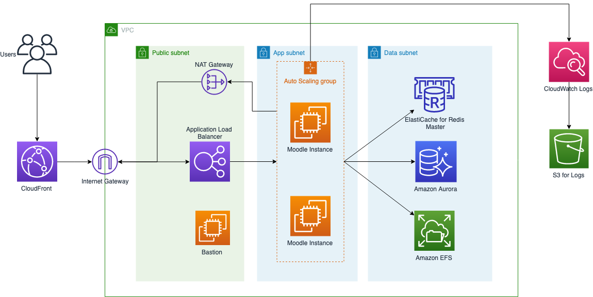

# Moodle on AWS

Moodle是一个学习平台，旨在为教育工作者、管理人员和学习者提供一个强大、安全、完整的系统来创建个性化的学习环境。

## 架构




## 部署说明

请认证阅读以下说明来了解架构。

1. 准备 ICP 备案过的域名。AWS 中国区 CloudFront 需要配置 ICP 备案的域名才能进行访问，如果您选择启用 CloudFront，请提前准备好 ICP 备案过的域名。

1. 确认弹性IP剩余额度。该 CloudFormation 堆栈会在您所选择的每一个 Availability Zone(AZ) 启动一个 NAT Gateway 来确保高可用架构。每一个 NAT Gateway 需要绑定一个弹性 IP. 默认情况下一个账号只能申请5个弹性IP。请在启动 CloudFormation 堆栈前确保您还有足够的弹性IP剩余额度。若弹性IP剩余额度不足，可通过工单来申请提升。

1. 提前在 ACM (Amazon Certificate Manager) 中创建 SSL 证书。在生产环境中，我们建议您同时为 CloudFront 和 ALB(Application Load Balancer) 配置 SSL 证书来开启 HTTPS. 若您计划启用 SSL, 在部署本方案前，请先完成在 ACM 中创建 SSL 证书。

2. 启动 CloudFormation 堆栈时， **将最小和最大 Auto Scaling Group（ASG）的值都设置为1**。 如果您配置了会话缓存，则 Moodle 初始化安装中可能会遇到如下错误
    ```
    Installation must be finished from the original IP address, sorry.
    ```

3. 堆栈部署完成后，导航至网站以完成 Moodle 安装。 注意：在安装向导的最后一步（设置管理员密码之后），您可能会遇到504网关超时或CloudFront错误。 您只需刷新页面即可完成安装。

4. 在 Moodle 站点配置中配置 Application Cache。

5. 现在，您可以**更新**刚刚部署的堆栈, 根据需要设置 **最小和最大Auto Scaling Group** 的值。

6. 如果您希望 Application Cache 和 Session Cache 共享一个 Redis 集群以节省成本，您可以在 CloudFormation 堆栈中选择不启用 Application Cache。在 Moodle 站点配置中将 Application Cache 和 Session Cache 配置到同一个 Cache Store.

## 步骤1: 启动 CloudFormation 堆栈

此自动化 AWS CloudFormation 模板在 AWS Cloud 上部署 Moodle 应用程序。

您负责运行此解决方案时使用的AWS服务的成本。 有关更多详细信息，请参见“费用”部分。 有关完整详细信息，请参阅此解决方案中将使用的每个AWS服务的定价页面。

如果您希望 Moodle Application Cache 和 Session Cache 使用同一组 Redis Cluster, 您可以选择只部署 Session Cache, 然后在 Moodle 站点内通过控制台进行配置。

如果您选择部署了 Application Cache, 待 Moodle 站点部署完成后，登录 Moodle 控制台进行配置。

1. 登录到AWS管理控制台，然后单击下面的按钮以启动 AWS CloudFormation 模板。

    [](https://cn-northwest-1.console.amazonaws.cn/cloudformation/home?region=cn-northwest-1#/stacks/create/template?stackName=Moodle&templateURL=https:%2F%2Faws-solutions-reference.s3.cn-north-1.amazonaws.com.cn%2Fmoodle-on-aws%2Flatest%2F00-master.template)
    
1. 默认情况下，该模板在 AWS 宁夏区域启动。 要在其他AWS区域中启动该解决方案，请使用控制台导航栏中的区域选择器。

1. 在**创建堆栈**页面上，确认 **Amazon S3 URL** 文本框中显示正确的模板URL，然后选择**下一步**。

1. 在**指定堆栈详细信息**页面上，为解决方案堆栈分配名称。

1. 在**参数**下，查看模板的参数并根据需要进行修改。 此解决方案使用以下默认值。

    **General AWS**

    | 参数            | 默认值    | 描述                                                  |
    | --------------- | --------- | ----------------------------------------------------- |
    | EC2 Key Pair    |           | EC2 Key Pair 名称，用于登录 Web 实例 |
    | SSH Access From | 0.0.0.0/0 | 允许登录 Bastion 的 IP 地址段 (CIDR格式)              |
    | Site Domain     |           | Moodle 站点域名                                       |

    **Network**

    | 参数                         | 默认值        | 描述                                                         |
    | ---------------------------- | ------------- | ------------------------------------------------------------ |
    | Number of Availability Zones | 3             | 创建 VPC 时使用的 AZ 数量. 这个数量必须与 Availability Zones 中选择的数量一致 |
    | Availability Zones           |               | Subnet 使用的 AZ.                                            |
    | VpcCidr                      | 10.0.0.0/16   | VPC CIDR                                                     |
    | VpcTenancy                   | default       |                                                              |
    | Public Subnet 0              | 10.0.200.0/24 | Public Subnet 0 在 AZ0 中的 CIDR                             |
    | Public Subnet 1              | 10.0.201.0/24 | Public Subnet 1 在 AZ1 中的 CIDR                             |
    | Public Subnet 2              | 10.0.202.0/24 | Public Subnet 2 在 AZ2 中的 CIDR                             |
    | Web Subnet 0                 | 10.0.0.0/24   | Web Subnet 0 在 AZ0 中的 CIDR                                |
    | Web Subnet 1                 | 10.0.4.0/24   | Web Subnet 1 在 AZ1 中的 CIDR                                |
    | Web Subnet 2                 | 10.0.8.0/24   | Web Subnet 2 在 AZ2 中的 CIDR                                |
    | Data Subnet 0                | 10.0.100.0/24 | Data Subnet 0 在 AZ0 中的 CIDR                               |
    | Data Subnet 1                | 10.0.101.0/24 | Data Subnet 1 在 AZ1 中的 CIDR                               |
    | Data Subnet 2                | 10.0.102.0/24 | Data Subnet 2 在 AZ2 中的 CIDR                               |

    **File System Tier**

    | 参数                 | 默认值         | 描述                                     |
    | -------------------- | -------------- | ---------------------------------------- |
    | EFS Performance Mode | generalPurpose | 文件系统的性能模式                          |
    | Encrpyted EFS?       | false           | 是否加密 EFS                             |
    | Add dummy data (GiB) | 0              | 在 EFS 中增加 dummy data                 |
    | Instance Type        | r4.large       | 在 EFS 中增加 dummy data 的 EC2 实例大小 |

    **Database Tier**

    | 参数               | 默认值      | 描述               |
    | ------------------ | ----------- | ------------------ |
    | DB Instance Class  | db.r5.large | 数据库实例大小     |
    | DB Master Username | moodle      | Master 用户名      |
    | DB Master Password |             | Master 用户密码    |
    | DB Name            | moodle      | RDS 默认数据库名称 |

    **Caching Tier**

    | 参数                                          | 默认值         | 描述                                                 |
    | --------------------------------------------- | -------------- | ---------------------------------------------------- |
    | Use Session Cache                             | true           | Moodle 是否启用 Session Cache                        |
    | Session Cache Node Type                       | cache.r5.large | ElastiCache 实例大小                                 |
    | Use Application Cache                         | false          | Moodle 是否启用 Application Cache                    |
    | Application Cache Node Type                   | cache.r5.large | ElastiCache 实例大小                                 |
    | Use CloudFront                                | false           | 是否创建 CloudFront                                  |
    | CloudFront Certificate ARN                    |                | CloudFront 使用的 SSL 证书ARN, 需要提前在 ACM 中创建 |

    **Web Tier**

    | 参数                   | 默认值   | 描述                                          |
    | ---------------------- | -------- | --------------------------------------------- |
    | Public ALB Domain Name |          | ALB 自定义域名                                |
    | ALB Certificate ARN    |          | ALB 使用的 SSL 证书ID, 必须提前在 ACM 中创建 |
    | Web Tier Instance Type | c5.large | Web 实例大小                                  |
    | Web ASG Max            | 1        | Web Auto Scaling Group 最大值                 |
    | Web ASG Min            | 1        | Web Auto Scaling Group 最小值                 |

    **Moodle**

    | 参数          | 默认值 | 描述                |
    | ------------- | ------ | ------------------- |
    | Language Code | en     | Moodle 站点默认语言 |

2. 选择**下一步**。

3. 在**配置堆栈选项**页面上，选择“下一步”。

4. 在**审核**页面上，查看并确认设置。 确保选中确认模板将创建 AWS Identity and Access Management（IAM）资源的框。

5. 选择**创建堆栈**以部署堆栈。

您可以在AWS CloudFormation控制台的**状态**列中查看堆栈的状态。 您应该在大约30分钟内看到状态为CREATE_COMPLETE。

## 步骤2: 配置 CloudFront 和 ALB CNAME

通过如下步骤找到 ALB 和 CloudFront 的 DNS Name. 如何配置 CNAME 记录取决于您使用的 DNS Resolver. 

1. 登录到 AWS 管理控制台，并选择进入 CloudFormation 控制台。

1. 选择步骤1中创建的 CloudFormation 主堆栈（请不要选择 NESTED 堆栈）。

1. 点击**输出**。

1. **PublicAlbDnsName** 为 ALB DNS Name, **CloudFrontDnsName** 为 CloudFront DNS Name.

登录到您的 DNS Resolver 控制台，配置域名指向这两处 DNS Name。


